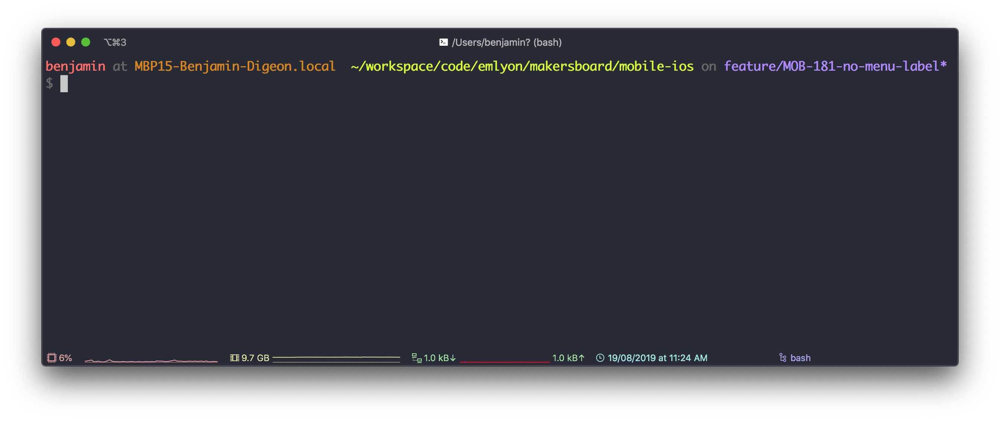

## Tech Lunch : Terminal

 
 

*21/08/2019*

**Benjamin Digeon**

Clever Age North America

---

## Human Computer Interaction

A little bit of history

Note: IHM in French, who use Machine insteed of Computer

----

## Inputs / Outputs

- How to pass data and/or commands to a machine ?
- How to reveive information from a machine ?

----

<!-- .slide: data-background="./img/Punched_card_program_deck.agr.jpg" data-state="dimbg" data-background-opacity="0.4" -->
#### Punched card

- Invented in **1725** for the control of a loom.
- Then use for playing back performances on a harmonium in **1881**.
- *Herman Hollerith* invented a electromechanical punched card tabulator used in the **1890** United States Census.
- Is company was later amalgamated with others then rename in **1924** the *International Business Machines Corporation*.

Note: So for now we just talk about tabulator, electromechanical computer are invented around 1938, then vacuum tubes and digital electronic circuits in 1942. Principle of the modern computer was proposed by Alan Turing in his seminal 1936 paper and first run in 1948.

----

<!-- .slide: data-background="./img/teleprinter-Siemens-t37h.jpg" data-state="dimbg" data-background-opacity="0.4" -->
#### Teleprinter

----

<!-- .slide: data-background="./img/mainframe-dumb-terminal-keyboard.jpg" data-state="dimbg" data-background-opacity="0.4" -->
#### Keyboard

----

<!-- .slide: data-background="./img/Xerox_Alto_mouse.jpg" data-state="dimbg" data-background-opacity="0.4" -->
#### Mouse

----
<!-- .slide: data-background="./img/macintosh.jpg" data-state="dimbg" data-background-opacity="0.4" -->
#### Monitor

---

## UNIX

 

> UNIX is very simple, it just needs a genius to understand its simplicity.
>
> **Dennis Ritchie**

Note: Creator of the C programming language and the Unix operating system

----

## Everything is a file

- TODO : Unix explaining

---

## Terminal 101

----

## MacOS default Terminal

  - TODO : Screenshot of someone default term

----

## iTerm

Note: And a lot of custom configuration

----

## Command

<asciinema-player src="./casts/tmpd_8s7ug3-ascii.cast" rows=30 cols=120 poster="npt:0:01"></asciinema-player>

---

## Advanced use case

----

## Tools

----

## Htop

---

<!-- .slide: data-background="./img/thank-you-jeanu-reeves.gif" data-state="dimbg" -->
# Thank you !

----

# Questions ?