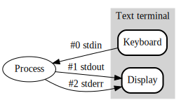

## Tech Lunch : Terminal

<br />
<br />

*21/08/2019*

**Benjamin Digeon**

Clever Age North America

---

## Human Computer Interaction

A little bit of history

Note: IHM in French, who use Machine insteed of Computer

----

### Inputs / Outputs

- How to pass data and/or commands to a machine ?
- How to receive information from a machine ?

----

<!-- .slide: data-background="./img/Punched_card_program_deck.agr.jpg" data-state="dimbg" data-background-opacity="0.4" -->
#### Punched card

- Invented in **1725** for the control of a loom.
<!-- .element: class="fragment" data-fragment-index="1" -->

- Then used for playing back performances on a harmonium in **1881**.
<!-- .element: class="fragment" data-fragment-index="2" -->

- *Herman Hollerith* invented a electromechanical punched card tabulator used in the **1890** United States Census.
<!-- .element: class="fragment" data-fragment-index="3" -->

- His company was later amalgamated with others then renamed in **1924** the *International Business Machines Corporation*. 
<!-- .element: class="fragment" data-fragment-index="4" -->

Note: So for now we just talk about tabulator, electromechanical computer are invented around 1938, then vacuum tubes and digital electronic circuits in 1942. Principle of the modern computer was proposed by Alan Turing in his seminal 1936 paper and first run in 1948.

----

<!-- .slide: data-background="./img/teleprinter-Siemens-t37h.jpg" data-state="dimbg" data-background-opacity="0.4" -->
#### Teleprinter (TTY)

- Used to replace the morse code, first implementation in 1844.
<!-- .element: class="fragment" data-fragment-index="1" -->

- A more complex character encoding scheme than Morse code
<!-- .element: class="fragment" data-fragment-index="2" -->

- One person who knows how to use a keyboard can replace 2 trained Morse code operators
<!-- .element: class="fragment" data-fragment-index="3" -->

- Also works when no operator is present for the reception
<!-- .element: class="fragment" data-fragment-index="4" -->

- Origin of the command-line interface
<!-- .element: class="fragment" data-fragment-index="5" -->

Note: A lot of things remain today, TODO

----

<!-- .slide: data-background="./img/macintosh.jpg" data-state="dimbg" data-background-opacity="0.4" -->
#### Keyboard, Monitor and Mouse

- When the CRT screens become available migration from TTY to screen + keyboard
- Then when graphical interface arrive add the mouse (apple)

Note: TODO

---

## UNIX

<br />

> UNIX is very simple, it just needs a genius to understand its simplicity.
>
> **Dennis Ritchie**

Note: Creator of the C programming language and the Unix operating system

----


Note: History of Unix systems (simplify), today Linux, BSD & MacOS, components architecture

----

### Architecture

- Kernel
<!-- .element: class="fragment fade-out" data-fragment-index="1" -->

- Development environment
<!-- .element: class="fragment fade-out" data-fragment-index="1" -->

- Commands
<!-- .element: class="fragment grow" data-fragment-index="1" -->

- Documentation
<!-- .element: class="fragment grow" data-fragment-index="1" -->

- And later a graphical interface
<!-- .element: class="fragment fade-out" data-fragment-index="1" -->

Note: A Unix type system is a modulary system compose of differents components. A terminal is about commands and documentation. Fun fact : Windows was initialy a command in MS-DOS for launching a graphical interface.

----

### Everything is a file

- Documents
- Directories
- Hard-drives
- Modems
- Keyboards
- Printers
- Process
- Network communications

Note: Not really a file : more accurate description "Everything is a file descriptor"

----

### Processes

Each process have :

- PID
- User
- Command

Note: PID0 system

----

### Users

- Multi-user system
- A special user named root who is the administrator and have every rights

----

### Permissions

- Each "file" has an owner, a group and some basics ACL
- More details in examples

---

## Terminal 101

Note: Let's talk about basic usage of the terminal

----

### MacOS default Terminal

- TODO : Screenshot of someone default term

Note: I'm gonna take the example of MacOS for now, 2 options the default and the more advanced terminal

----

### iTerm


Note: And a lot of custom configuration

----

### RTFM

```bash
man man
```

<asciinema-player src="./casts/man.cast" rows=30 cols=120 poster="npt:0:01"></asciinema-player>

Note: Read the fucking manual ! Most important command, read any command documentation

----

### Special characters

<br />

```bash
.  # the current working directory
.. # the parent directory to working directory
~  # your home directory
/  # the root (top-level) directory. 
   # This is also the separator for directories
*  # a wildcard meaning any string of characters
?  # a wildcard meaning any single character
```

----

### Some commands

<br />

```bash
ls                # List files in this directory
pwd               # Where am i ?
cd                # Change directory
file filename.ext # What is this file ?
touch filename    # Create a file
mkdir directory   # Create a directory
clear             # Clear the screen (ctrl+l)
cp file1 file2    # Copy
mv file ~/tmp/    # Move
rm file           # Remove
rmdir directory   # Remove empty directory
```

<br />

Most commands support autocompletion with ↹

Note: Basic commands, a litle live coding for explaing that a litle more, use of man, tab and options. Talk about invisibles files and folder

----

### More commands

<br />

```bash
cat  # Read file
more # Read file ++
less # Read file +++
tail # Read end lines
head # Read first lines
wc   # Count
```

Note: Explain > & >>

----

### Permision

<br />

```bash
chmod # Change file modes or ACL
chown # Change file owner and group
```

Note: ACL: Access Control Lists

----

### Interrupt keys

- **ctrl C** : interrupts whatever is currently running. 
- **ctrl Z** : puts a foreground process into the background.
- **ctrl S** : suspends current terminal
- **ctrl Q** : resumes current terminal

----

### Input and ouputs

<br />



<br />

```bash
cat 'doesnotexist.txt' 2>/dev/null
```

----

### Output codes

<br />

- A program has always an exit code
  - **0** if success
  - **1** to **255** anything else
- Read the manual for each program

<br />

```bash
cat file.txt
echo $?
cat doesnotexist.txt
echo $?
```

----

### Redirecting

```bash
echo 'toto' > file.txt  # Redirects
echo 'toto' >> file.txt # Append
more < terminal.md      # Take input
command1 | command2     # Pipe stdout to stdin
```

Note: Pipe explaining in the next slide

----

### Piping


Note: `ps -A | grep chrome`

----

### Processes

<br />

```bash
ps   # Display processes status
top  # See information about processes
htop # Top +++
```

----

### Signals

<br />

```bash
kill -9 badProcessPID
```

<br />

- `3` QUIT (quit)
- `6` ABRT (abort)
- `9` KILL (non-catchable, non-ignorable kill)

----

### Xargs

<br />

```bash
# When testing always use xargs -t

echo 'one two three' | xargs mkdir
find /tmp -mtime +14 | xargs rm
```

---

<!-- .slide: data-background="./img/thank-you-jeanu-reeves.gif" data-state="dimbg" -->
# Thank you !

----

# Questions ?